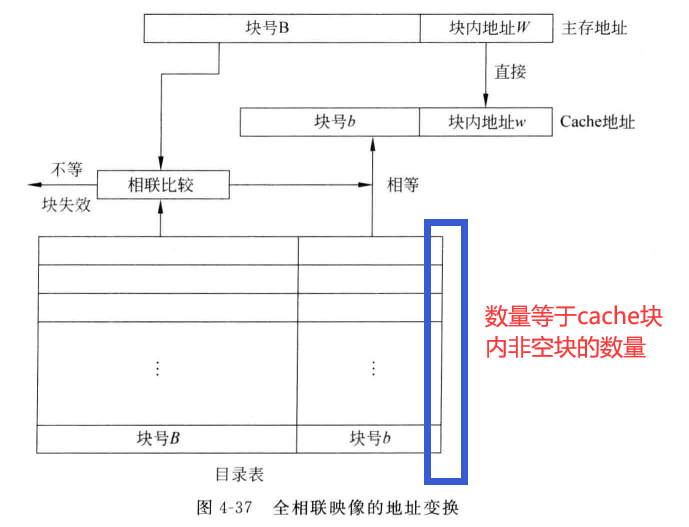
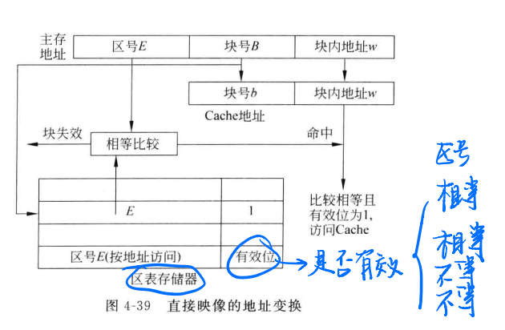

### 存储体系

- 存储器容量

$$
Sm=W*l*m
$$

> **虚拟存储系统**

- 虚地址（逻辑地址、程序地址）：计算机所能产生的地址位数构成的地址空间
- 汇编里面还讲过一个线性地址，这个线性地址基于虚地址和实地址之间，如果不需要分页，则线性地址就为物理地址，如果需要分页，则经过分页之后映射为物理地址。

- 实地址（物理地址）：地址范围在实际主存容量范围内
- 通过不同的映像算法来实现虚地址到实地址的转换
- 算法分为
  - 段式
  - 页式
  - 段页式
- 汇编里我们所书写的地址都是逻辑地址。

1. **段式存储管理方式**

   - 按逻辑意义分为段，按段进行调入调出管理。
   - 按函数、内容分成段，段的长度不一定。
   - 和段寄存器有关
   - 段与段之间在主存的位置关系没有限制
   - 映射需要段表（有点像汇编里的段描述符？但是汇编里段描述符之间貌似不是连续存在一起的，而可能是分散在局部、全局描述符表里的？总而言之，这些描述符在逻辑上构成了一张段表）：
     - 记录有
     - 段号
     - 段起始地址
     - 段长
     - 装入位（是否已经装入主存）
     - 访问方式
   - 多用户虚地址：
     - 用户号（通过用户号在段表基址寄存器中找到对应的段表基址）
     - 段号（在段表中找到对应段号（基址和段号相加）的条目）
     - 段内偏移量（从条目中读出段的起始地址（如果在内存的话，不在则引发中断），再和偏移量相加）
   - 优点：
     - 模块性好
     - 便于程序和数据的共享
     - 便于实现信息保护
     - 程序动态链接和调度比较容易
   - 缺点：
     - 地址转换要做两次加法运算，查两次表，花费较长时间。
     - 主存的利用率会比较低，因为段内要求连续，会产生空隙。
     - 对辅存的管理比较困难，因为段是变长的，而辅存是按块存储的。

2. **页式存储管理方式**

   - 主存空间和程序空间都划分为固定大小的页面，
   - 主存的页称为实页，虚存的页称为虚页。
   - 由页表指出虚页和实页之间的对应关系，由地址映像机构将虚页号转换成主存的实页号。
   - 页表：
     - 装入位
     - 修改位
     - 主存页号
     - 标志
   - 虚地址：
     - 用户号（定位页表基址寄存器，给出页表的基址）
     - 虚页号（与页表基址相加得到页表项地址）
     - 页内偏移（由页表项中的主存页号字段获取实页号，实页号与页内偏移拼接得到物理地址）
   - 优点：
     - 主存利用率高，只有不到一页的浪费
     - 页表相对简单，保存的字段比较少
     - 地址变换速度比较快，只需要一次加法两次访存。
     - 对磁盘的管理比较方便，页的大小应该是磁盘的整数倍
   - 缺点：
     - 模块性不好
     - 页表很长，需要占据很大的存储空间

3. **段页式存储管理**

   - 先按逻辑分段，再对每段进行分页
   - 因此一个用户访存有一个段表、若干页表
   - 虚地址：
     - 用户号（根据用户号查段寄存器，得到段基址）
     - 段号（加上段基址得到段表项，指出了页表基址）
     - 段内页号（与页表基址相加得到页表项，得到页基址）
     - 页内偏移（与页基址拼接得到物理地址）
   - 段的长度必须是页的整数倍
   - 缺点：
     - 速度慢，两次查表
     - 可能需要多级页表
   - 优点：
     - 综合了段式和页式

4. **三种方式比较**

   - 

     

> **页式虚拟存储系统地址映像**

- 地址映像：指的是虚存单元（虚页）按照什么算法装入主存的。
- 如果内部地址变换命中则完成从虚地址到物理地址的转换；不命中则产生缺页中断。查外页表到磁盘中寻页。如果磁盘找到了则查看主存是否还有空页，如果没有则需要替换算法，否则直接调入。如果磁盘找不到则到海量存储器中寻找。
- 每一个用户程序都有一张外页表，产生缺页中断时，会由软件进行从虚地址到辅存地址的变换，因而很慢。

1. **页面替换算法**

   - 页面失效：是指该页未装入主存，需要从辅存中调页
   - 页面冲突：是两个页想占用主存同一个页面的现象
   - 页面替换算法：
     - 衡量标准：是否具有高的主存命中率，是否便于实现，是否成本够低
     - 主存页面替换用软件、cache页面替换用硬件。
     - 虚拟存储系统中，快表中存储字的替换用硬件实现。
   - 页面替换算法种类：
     - 随机算法，没利用历史信息，没反应局部性
     - FIFO：利用了历史信息，没有反应局部性。
     - LFU（最近最少使用）：反应了历史信息和局部性。每次换出使用次数最少的页。需要用到若干计数器。
     - LRU（最久没有使用）：把LFU中的多和少换成了有和无，比较容易实现。每次换出最久没有使用的。（每次使用则放到队列顶部）
     - OPT（最优替换算法）：选择将来最久不被访问的页换出。（然而这是不可知的，只能事后分析）
   - FIFO算法和LRU算法可能会发生颠簸现象：即下一次要使用的页在这一次就被替换出去。
   - 命中率取决于：
     - 算法
     - 页地址流
     - 分配的实页数（但是有的算法会随着实页数的增加命中率下降，这样的算法称为非堆栈型算法）
   - 堆栈型算法：（OPT、LRU）
     - 

2. **提高页式存储管理页表访问速度**

   -  使用目录表

     - 是一种小容量高速的存储器，将页表转移到目录表中来。
     - 将用户号和虚页号相连查找页表项
     - 优点：
       - 速度比在主存中的页表快，避免了二次访存
     - 缺点：
       - 造价高
       - 容量小
       - 扩容会导致查找速度变慢

   - 使用快慢表

     - 类似于cache-主存存储体系
     - 经常访问的页面地址存入一个小容量的高速存储器，只是慢表的一部分副本
     - 快表(TLB)采用相连方式访问（即用户号和虚页号相联）
     - 同时查快表和慢表，快表若命中则终止慢表查找，慢表命中则送入快表，并与页内偏移拼接，得到主存实地址。
     - 慢表送入快表时，快表若满了则需要采用替换算法。

   - 使用散列函数

     - 不同于相联访问的按内容访问，散列函数是按地址访问，因此速度更快

     - 散列函数为什么可以加大快表容量：相联访问按内容查找，快表不能太大。而按地址访问相对就节省时间，容量可做大些。

     - 基本思想：**在快慢表的基础上**，将多用户虚页号加入快表，使用哈希函数将虚页号映射到快表项地址Ah，这样就免去了相联比对的过程，进一步加快了快表的查询。

     - $$
       Ah=H(Pv)
       $$

     - Pv指的是虚页号；当然，由于不同的Pv可以对应同一个地址。因此散列之后需要将Pv与用户虚页号进行相等比较，如果相等则命中，不相等则等待慢表的查询结果。
     - 

3. **影响主存命中率和cpu效率的因素**

   - 因素：
     - 地址流分布情况
     - 页面替换算法
     - 页面大小（不是主存页数）
     - 主存储器的容量
   - 随着页面大小上升命中率先上升后下降：
     - 上升是因为一开始页的大小太小了，随着页面大小增加，相邻两次访问主存的地址更可能在同一个页内
     - 下降是因为页在主存可以不连续存放即程序段或者数据段可以跳跃，如果页太大的话会使得主存的页面数减少，使得命中率下降。

4. **cache存储体系**

   - 不要与快表混淆，快表里面存的是快表项，快表项是用来定位主存地址的。而cache里面存的已经是数据，可以直接供CPU使用。
   - cache和主存都机械的分为大小相同的块；如果cache命中则将主存地址改为cache地址直接访问cache。不成功则用主存地址；cache已满时采用替换苏纳法腾出空间。
   - 主存地址（物理地址）：
     - 块号
     - 块内地址
   - 通过主存-cache地址映像变换机构将主存地址块号转换得到cache块号。
   - 在cache存储体系中：地址映像指的是把主存块按照某种规则装入cache中。
   - 地址映像需要考虑的因素有：
     - 地址变换的硬件要容易实现
     - 地址变换速度要快
     - cache利用率要高
     - 块冲突的概率要小
   - 地址映像的方法有三种：（区别虚拟存储系统的三种地址映像方法）
     - **全相联映像：**
       - 主存块可以放在任意一个cache块上
       - 采用目录表＋相联比较的方式
       - 
     - **直接映像变换：**
       - 每一个块只能映射到cache的唯一位置，具体方式是取模
       - 将上述的块号划分成区号+块号，块号的长度和cache的块号长度一致。区号是长出来的部分。
       - 区表存储器的表长=cache块个数
       - 只需要按地址访问区表存储器即可
       - 
     - **组相联映像变换**
       - 将cache块分为组，每个内存块只能对应一个组，但可以放置在组内任意一个位置。
       - 优点：冲突概率小，cache块的利用率提高
     - **cache******块替换算法****
       - 直接映像变换不需要替换算法
       - 组相联映像和全相联映像需要替换算法
       - 算法（针对LRU算法的不同实现）
         - 堆栈法：采用硬件堆栈，实现全下移，部分下移，抽取一项等功能
         - 比较对法：所需要比较的块两两组合，如ABC三块，组合成AB、AC、BC。如果A比B最近访问，则TAB=1.
   - **cache透明性分析**
     - 对系统程序员和应用程序员都是透明的。CPU只知道主存的地址（逻辑地址），不知道cache的地址码
     - cache是主存的一部分副本，存在与主存不一致的可能性：
       - cpu写cache但未写回主存
       - io写主存但是没写cache
     - 提出了两种解决cache一致性的算法：
       - 对于写cache不命中的情况：
       - 写直达法（write-through）
         - cpu写cache的时候也写回主存
       - 写回法（write-back）
         - cpu只写入cache，仅当cache替换时才写回主存
         - 更快，并且cache表中有一个修改位1，表示该cache块被修改过，替换时要写回主存。
       - 可靠性：写直达法>写回法
       - 效率：写回法>写直达法
       - 控制的复杂性：写回法更复杂
       - 硬件代价：写回法比写直达法更好
     - 对于写cache不命中的情况：
       - 不按写分配：
         - 不命中则直接把数据写入对应主存
       - 按写分配：
         - 从主存读入cache，再修改主存
     - 对于多cpu处理机：各个cpu都有自己的cache，那么不同cache之间可能存在不一致的情况。
       - 
       - 采用播写法：写cache时要将信息传播到所有存入此单元的地方，改变或者让这些块作废
       - 控制某些共享信息不得进入cache
       - 目录表法：在写cache不命中时，查目录表，看是否在别的cache中共享，然后再决定如何读写
   - 优化cache：
     - 对于命中率：
       - 增大cache容量
       - 增大相联度，降低冲突
       - 增加cache块的大小
     - 对于减少失效开销：
       - 多级cache
       - 使得读失效优先于写失效
     - 缩短命中时间：
       - 避免在索引缓存期间进行地址转换？
   - cache-主存-辅存三级层次
     - cache-主存、主存-辅存两个独立的存储系统。
     - 一个存储系统组织方式，cache能接收虚拟地址
     - 全cache系统，没有主存，cache直接连接磁盘。

