### 流水线与向量处理机

> ###### **流水线**

- **重叠方式**

  - 指令的解释方式
    - 顺序解释方式：只有当前一条指令执行完下一条才会进入
    - 重叠解释方式：前一条之指令第一阶段进行完，后一条指令马上进入。即各个阶段在时间上重叠进行。
  - 指令的三个阶段可以分为：**取指、分析（取数）、执行**
  - **一次重叠**：令指令的执行阶段和下一条指令的取指阶段同时进行，每一阶段处理时间尽可能等长，总时间T=（1+2n）t. [n为指令条数，t为一个阶段所花费时间]
    - 一次重叠的问题：需要增加一些硬件，控制过程稍微复杂
  - **二次重叠**:时间花费：T=(2+n)t
    - 问题：
      - 要有独立的取指令、分析指令、执行指令的部件
      - 取指和取数时存储器可能冲突。解决主存冲突问题（采用低位交叉存储方式、独立的存储器如独立指令和数据存储器【哈弗结构】）
  - **相关处理**
    - 邻近的指令之间发生了关联，为了避免出错，导致他们不能同时解释的现象称为相关
    - **指令相关**：指令在程序执行过程中允许被修改造成的。如一个jmp指令跳到别处就导致了jmp指令后一条指令不应该被执行。（第k条指令形成第k+1条指令）
    - **数据相关**：第k条指令与第k+1条指令之间数据地址有关联、
    - 重叠方式的机器尽量减少使用条件转移指令。或者采用延迟转移技术
    - .暂时不想看了...待补充

- **流水方式**

  - 流水方式和重叠方式的差别在于流水方式将一个过程分为多个子过程

  - 特点：

    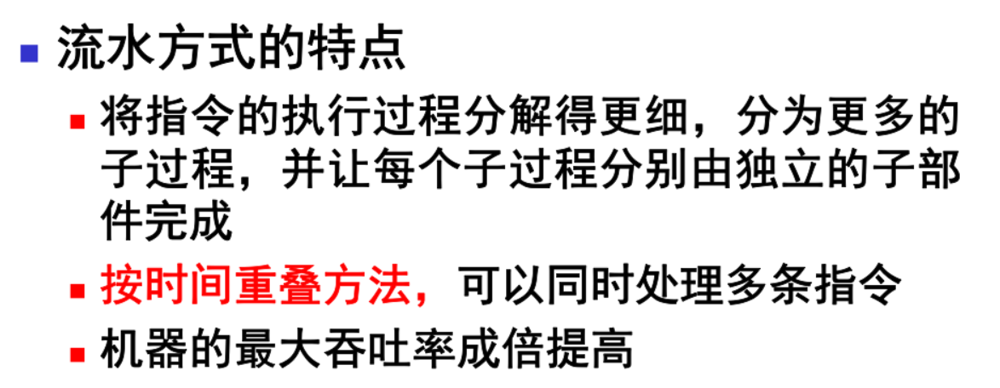

  - **吞吐率**

    - 最大吞吐率
      - 取决于子过程经过的时间
    - 实际吞吐率
      - 子过程的时间
      - 进入流水线的任务数
    - 最大吞吐率>=实际吞吐率

  - 流水线的每一个子过程称为**阶段**

  - 流水线的三种表示方法

    - 连接图
    - 时空图（横轴时间纵轴空间）
      - 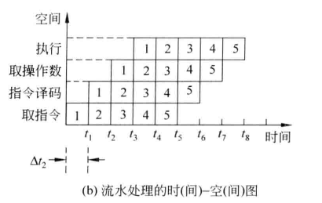
    - 预约表

  - 流水线有“装入时间”，“排空时间”。每个流水阶段的时间尽量相等，否则会引起流水线阻塞。

  - 流水线的“加速”是体现在多个任务数上的。使得处理每个任务的平均时间相对于单独处理该任务缩短了。

  - 流水线可以用到不同粒度的任务上：

    - 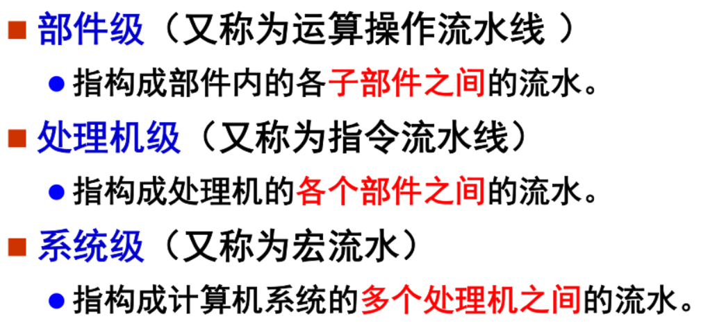

  - 可以根据流水线具有的功能多少分类：

    - 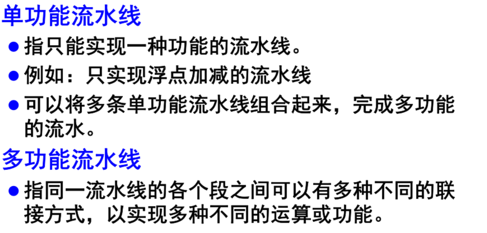

  - **多功能流水线**的基础上，流水线被划分为静态或者动态：

    - 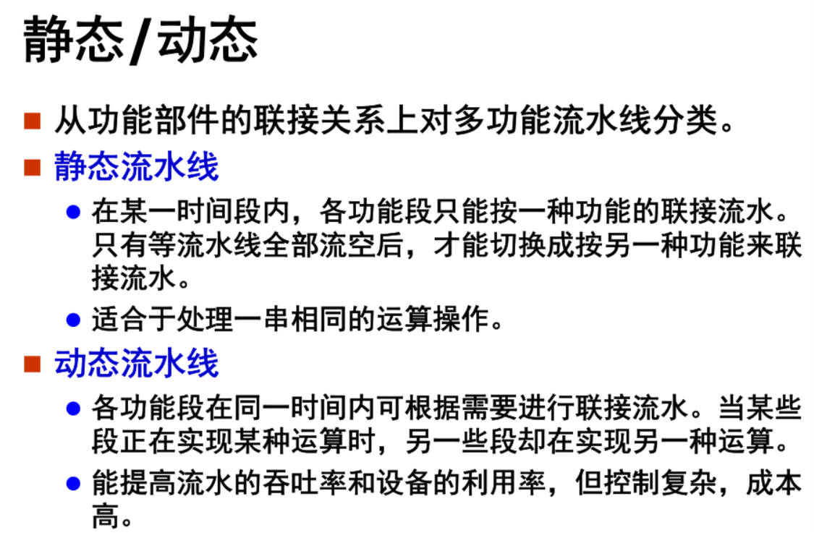

  - 按照各个功能段之间有没有反馈、前馈回路（即二次加工或跳过）分为线性流水线和非线性流水线：

    - 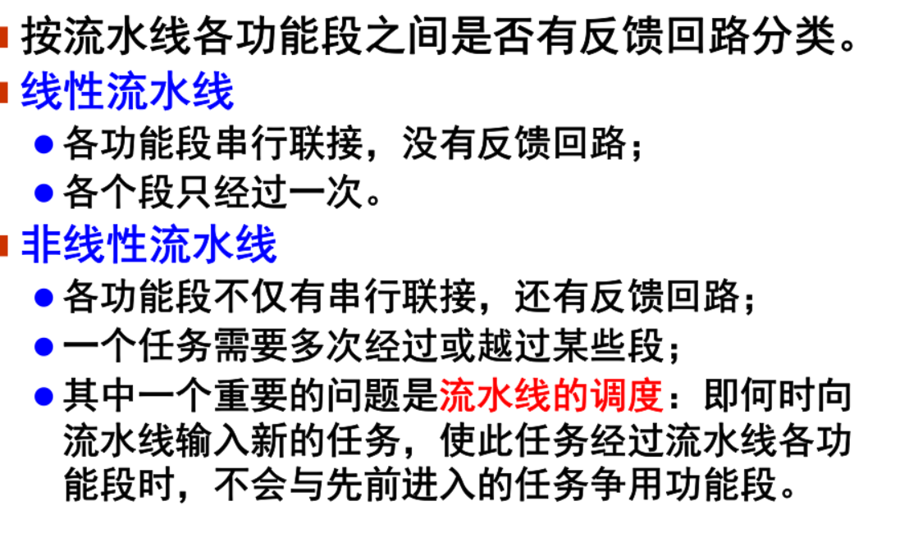

- **流水线处理机主要性能评价指标**

  - 吞吐率

    - 单位时间内处理的任务数
    - 最大吞吐率取决于子过程中最大处理时间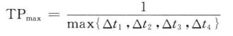
    - 最长的时间子过程称为瓶颈子过程
    - 解决瓶颈问题的方法：
      - 将瓶颈子过程进一步细分成若干子过程
        - 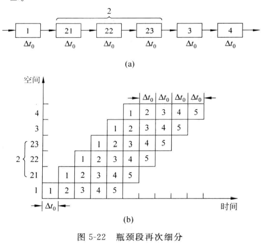
      - 将瓶颈段重复设置多个处理装置，使得速度翻倍
        - 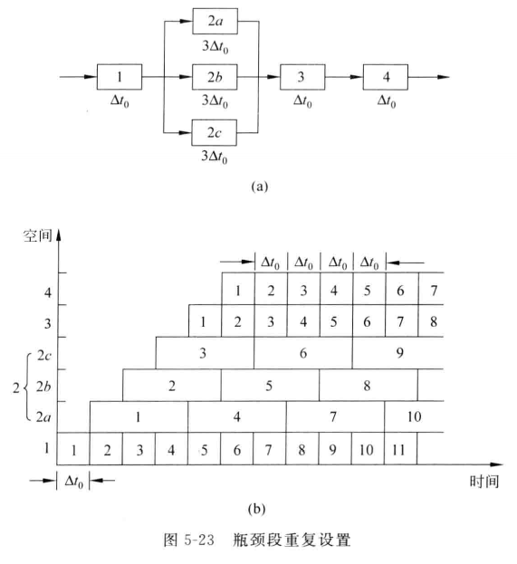

  - **加速比**

    - 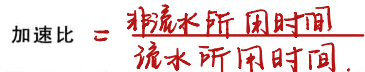
    - 设m为阶段数，n为任务数，如果任务数n远大于m则，加速比趋近于m
      - 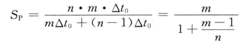

  - **效率**
  
- 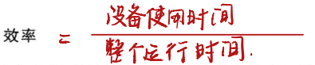
    
    - 注意：整个运行时间是指从第一个进入流水线开始到最后一个流出流水线的总时间乘以总设备数；设备使用时间是指所有设备运行时间总和
    
- 对于各段非等长的时间段或者是非线性的流水线来说，效率=n个任务实际运行时间/m个段的总时间
  
- **非线性流水线调度**

  - 在非线性流水线中由于存在反馈回路和前馈回路因此有可能出现两个任务争用一个机器的情况。
  - **想不发生冲突就得间隔适当拍数之后再向流水线输入下一个任务**
  - 单功能流水线预约表：
    - 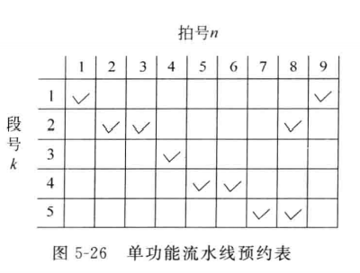
    - 段号：一共有多少阶段
    - 拍号：一个任务从开始到完成所花时间
    - 一张表对应一个任务，由于是单功能流水线，故每个任务的情况都相同。
    - 图中横向来看不连续的√说明了这是个反馈回路。
  - 横向求√距离，将距离构成一个禁止向量F。表示若相邻任务间隔这么久则**一定**会导致冲突。但是如果不在禁止向量中的元素就一定不会冲突吗？并不一定
  - 由禁止向量F得到**初始**冲突向量C：
    - C=（CmCm-1...C2C1）
    - m等于禁止向量中最大的那个值
    - 若i在禁止向量中，则Ci=1，否则Ci=0；
  - 将初始冲突向量送入逻辑右移移位器。
    - 若当前移位器中的冲突向量，移出的为0，则与**初始冲突向量**做按位或，得到新的冲突向量
    - 若移位为1则不做任何处理。
    - 循环移位器的长度这么多次。
    - （总结：移位器中表示的是之前若干次会冲突的情况，每次与初始冲突向量按位或是考虑新进入的任务）
  - 流水线状态图：
    - 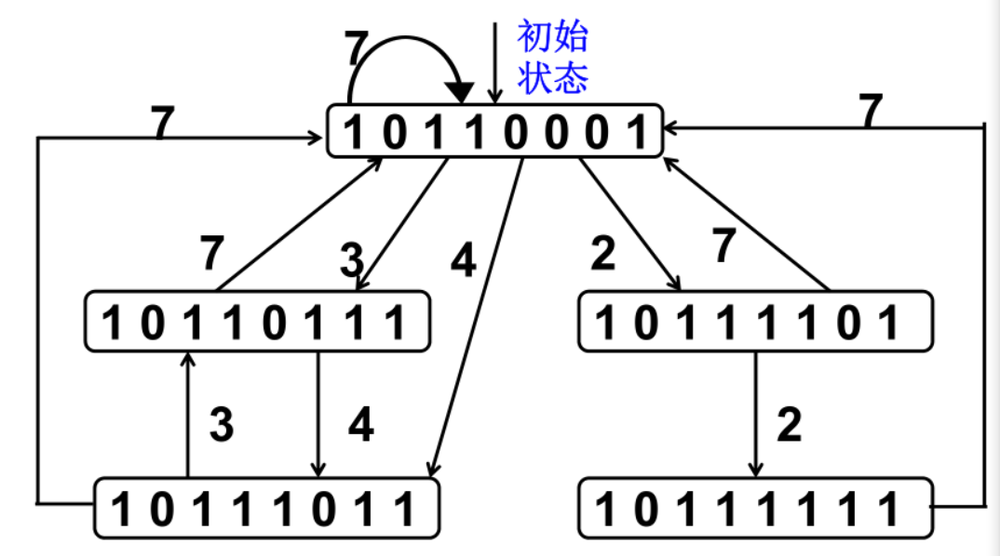
    - 箭头上的数字是表示移位个数。
    - 圆圈里的是位移器里的状态。
    - 若出现环则证明能够在不冲突的情况下进行调度，出现多重环则说明有多种调度方案。
    - 构成的环可以按箭头数字顺序写成一个tuple，表示调度方案（最小启动循环）。求和再取平均值（最小启动循环），取所有方案里最小的即可。
    - 为了简化控制，也可以采用 等间隔调度，但常常会使吞吐率和效率下降。

- **多功能非线性流水：**将每种功能的预约表都叠加在一起，然后构造交叉冲突向量，以反映多功能动态流水线的各个后继任务流入流水线时应禁止使用的拍数间隔。

- **流水线相关处理**

    - 分类
        - 全局相关：
            - 会使得指令缓冲器预取的指令失效
            - 例如分支跳转、循环语句
        - 局部相关：
            - 包括指令相关、主存数据相关、通用寄存器数据相关、通用寄存器基（变）址值相关
            - 最多影响到某些段使他们推后
    - 解决方法：
        - 全局相关：
            - 猜测法，按概率猜测会进入哪一条分支
            - 加快和提前形成条件码
        - 局部相关
            - 先写后读
            - 设置相关专用通路

- 流水机器中断处理

    - 不精确断点法：
        - 未进入流水线的停止进入，进入流水线的继续跑完，再转入中断处理程序
        - 中断响应时间长、不利于排错
        - 逻辑简单
    - 精确断点法：
        - 需要把断点之后的指令结果都保存下来。
        - 硬件代价高

> #### *向量的流水处理与向量流水处理机*

- 向量流水处理机（向量处理机）：

  - 向量数据表示+流水处理方式

- 向量处理机一般都采用流水线结构。有多条流水线并行工作。

- 向量处理机需要包括一台高性能标量处理机，否则标量运算会成为整个运算过程的瓶颈。

- 向量的处理方式有三种：

  - 横向（水平）处理方式：每个元素运算到底，再取下一个元素（**标量机上采用循环程序实现**）
    - 频繁切换功能
    - 两条指令之间可能存在相关
  - 纵向（垂直）方式：每一个元素运算一个阶段后保存结果，接着换下一个元素。所有元素运算完则进行下一阶段处理
    - 元素之间无相关（因为都是先写，没有先写后读）
    - 只需要切换一次
    - 可能没有这么多寄存器
  - 分组方式：
    - 寄存器组内采用垂直方式，寄存器组之间采用水平方式
    - 即：先垂直方式对第一组寄存器算到底；之后切换功能开始第二组....
  - 纵向方式更适合流水处理，但是分组方式更符合实际

- 指令级高度并行的超级处理机：

  - 超标量处理机（设置多条流水线）
    - 个时钟周期内能够同时发射多条指令的处理机称为一个时钟周期内能够同时发射多条指令的处理机称为 超标量处理机 
    - 一个周期内执行完m条指令
    - 单发射：每个周期值取、译码、执行、写回一条指令
    - 多发射（超标量处理机）：每个周期值取、译码、执行、写回多条指令
  - 超流水线处理机（提高流水线时钟频率）
    - 一个周期内能够分时发射多条指令的处理机称为超流水线处理机
  - 超标量超流水处理机
    - 二者相结合
  - 超长指令字处理机
    - VLIW 将多个能并行执行的不相关或无关的操作先行压缩，组合在一起，形成一条有多个操作段的超长指令

  